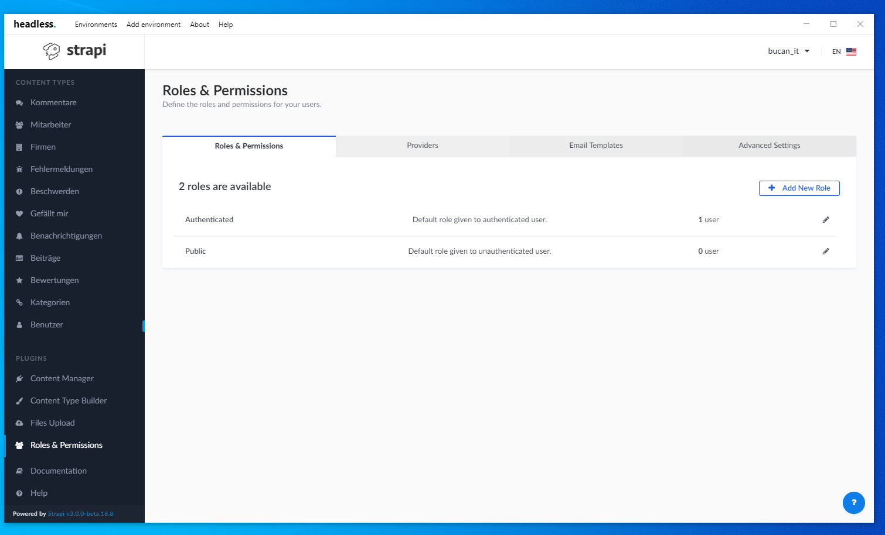
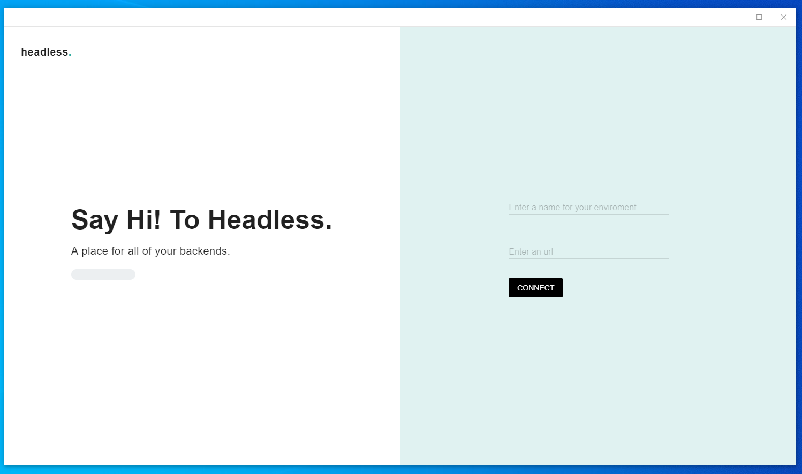
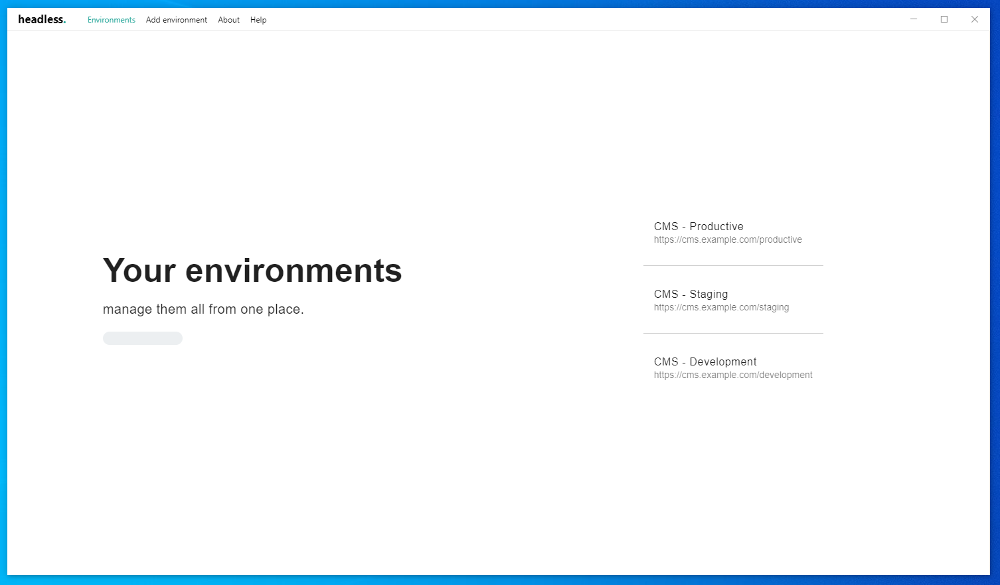

<p align="center">
  
</p>

# What is headless? 

Headless is a [Electron](https://goo.gl/search/Electron) based wrapper for your favorite web based CMS of choice(s).

## What are the benefits of headless? 🤖

Headless allows you to configure multiple enviroments with different URL's and let's you switch between them with ease.



## Installation ⏳

1. Clone the Repository via git or download it directly.

```
git clone https://github.com/fabio-nettis/headless.git
```

2. Install dependencies and build the application.

```
yarn && yarn dist
```

3. Navigate to the dist folder

```
cd dist
```

4. Run the created appropiate installer for your OS.

## Getting started

You have successfully executed all 4 installation steps? Amazing! Let's get you started by making you familiar with the **headless** UI!

------

Add an environment to get started.



------

Try switching between your environments.



Thats it. Your all set! Enjoy headless alpha-1.0.0 with more features to come soon! 😁

------

## Credits

headless logo created by [CrescentMage](https://twitter.com/xCrescentMagex?s=09)
